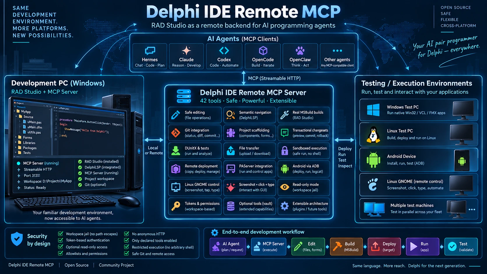

# Delphi IDE Remote MCP Server

[](https://github.com/soporte-defontsoft/delphi-ide-remote-mcp/releases/latest)
[](LICENSE)



**An MCP server that remote-controls a full RAD Studio (Delphi IDE) installation — language server, build system, deploy chain — so you can develop in Delphi from any platform. And the agent gets eyes and hands on a real screen too — an Android device, a Linux GNOME desktop or a Windows desktop behind a PAServer (the server's own included): it sees what is there and drives it.**

📦 **[Download the ready-made Windows binary →](https://github.com/soporte-defontsoft/delphi-ide-remote-mcp/releases/latest)** (no Delphi needed to *run* the server binary; the machine it runs on needs its own licensed RAD Studio — see [Quickstart](#quickstart)).

The Windows machine holds RAD Studio and the projects. You work from wherever you actually want to be: a Linux laptop, a Mac, a cloud agent, a CI runner. Understand the code, edit it safely, scaffold, build, run, package, fetch the binaries, commit — and then deploy to a real target and **watch your app run there, pressing its buttons yourself** — the whole cycle over MCP, with Delphi installed on **neither** the client nor the agent.

It is not a language-server bridge. Semantic understanding is one capability of many, and it is the one that is genuinely hard, so it runs on Embarcadero's official `DelphiLSP.exe` — the same engine behind Code Insight in the RAD Studio IDE. But the language server backs **8 of the 41 tools**; the other 33 are the working day: the safe editing engine, MSBuild, git, the file tools, the project scaffolder, the deploy chain (PAServer, adb), the knowledge vault. See [What each tool actually runs on](#what-each-tool-actually-runs-on) for the exact split.

Runs as a **Windows Service**, a terminal process or a tray app — one executable, three modes — keeping language-server processes warm across agent sessions and serving multiple AI clients (Claude Code, Claude Desktop, or any MCP client) over Streamable HTTP, with a classic stdio mode as well.

> **Status: stable (1.1.2).** Covered by 76 end-to-end batteries — 1,756 checks — against DelphiLSP 37.0 (RAD Studio 13), and by a full day of real-world field testing by an independent agent using it as a client. A minor version adds tools or capabilities, a patch fixes, and a documented contract that changes is announced in the CHANGELOG first. See [docs/ARCHITECTURE.md](docs/ARCHITECTURE.md) and [docs/DELPHILSP-NOTES.md](docs/DELPHILSP-NOTES.md) for the measured research this project is built on, [CHANGELOG.md](CHANGELOG.md) for versions, and [docs/ROADMAP.md](docs/ROADMAP.md) for what is delivered, open, parked or declined.

## Why

AI agents working on Delphi codebases are usually limited to text search (grep). This server gives them the **full remote development workflow over Delphi and its projects** — understand, edit safely, verify, build, deploy, run and drive the result — through the real compiler front-end and inside an operator-declared jail. In short: **RAD Studio turned into a remote backend for programming agents.**

**The core idea: centralize Delphi, work from anywhere.** One Windows PC or VM holds the RAD Studio installation and the projects; this server runs there. Everything else — your laptop, a Linux box, a CI runner, an agent in the cloud — connects over MCP HTTP and gets the full development cycle (locate a project, read, edit, scaffold, build, run, download the binaries, commit) **without installing Delphi, or anything at all, on the client side**.

**The showpiece: your app on a real Linux desktop, seen and driven from the agent.** Deploy to a GNOME machine through PAServer, launch it with `remote-run` (the program is not killed when the call returns — a window is meant to stay up), and then `delphi_desktop` brings the **whole desktop back as a PNG**, presses the exact pixel you measured, types into your app, walks its windows. Beyond PAServer itself there are no prerequisites and nothing to install by hand on the target: it executes what this server sends, and the tiny helper node — **shipped inside this release** — deploys and updates itself on first use. It is the same eyes-and-hands idea `delphi_adb` gives you on Android — pointed at a Linux desktop. Today it speaks GNOME (Zorin and Fedora, measured live). And the node itself is the proof of the whole premise: **it was developed entirely through this server** — an AI agent on the other end of the MCP wrote it, compiled it, deployed it and debugged it against the live targets, without ever sitting at the Windows machine. This repo dogfoods its own tools.

**And the same eyes and hands on a Windows desktop - including the server's own.** Since 1.0.16 there is ONE desktop tool, `delphi_desktop`, and the machine is a parameter: the PAServer profile. Point it at a Linux, at a Windows with PAServer, or at this very server when a PAServer runs in its user session (`windows-local`, 127.0.0.1): same node, same gestures, same permissions (`AllowRemoteRun`, `RemoteHosts`, `RemoteRunProjects`). Every remote execution - Linux or Windows - goes through ONE mechanism: a job file (the binary, the output file, then one argument per line) and a native launcher (`node\McpRunJob`, `node\McpRunJob.exe`) that PAServer starts; there is no shell in the path, so an agent's arguments reach the program as argv, untouched. The old name, `delphi_adb_linux`, no longer exists.

## Use cases

Two credential levels — a full read-write token, and a read-only one — let very different agents share the same live codebase safely. The read-only level can read, search, navigate symbols, get diagnostics, follow definitions into RTL/VCL and installed components, download files and run query-only git; it can touch **nothing** on the server. That opens up a range of setups:

- **Move your daily work to another OS.** The Windows box with RAD Studio becomes a remote build server; you drive it from a Linux laptop, a Mac, or a cloud agent. Full read-write token, VPN/LAN only. Edit, scaffold, build, run, fetch the binaries, commit — Delphi never leaves the server.
- **Deploy-and-verify on a real Linux desktop, hands on the app.** Build on Windows, deploy over PAServer, launch with `remote-run`, then SEE the GNOME desktop and drive the app — tap its buttons, type into its fields, close its windows — all from the agent, with nothing installed on the Linux box. The closing mile of the cycle: not "it compiled", but "I watched it run and used it". Since 1.0.16 the launch also works when PAServer runs as a **service** on the target: the launcher completes the graphical session's `DISPLAY` / `WAYLAND_DISPLAY` / `XAUTHORITY` when PAServer did not inherit them, and the answer says so (`graphicalEnv`).
- **A documentation / wiki / RAG agent that cross-checks the real source.** Give it the read-only token. It maintains the wiki or answers questions from a RAG index, and whenever it needs to be sure, it confirms the claim against the actual code — "does `TOrderService.Post` really validate the tax id?" — instead of trusting a possibly-stale document. Grounded answers, zero write risk.
- **A code-review / audit agent on every branch.** Read-only. It reads diffs, walks symbols with compiler-grade accuracy, follows calls cross-unit and into VCL, runs on-demand diagnostics (real E/W/H codes, no build) — and cannot alter the tree it is reviewing.
- **An onboarding / Q&A assistant for the team.** Read-only, pointed at the whole `Roots`. New developers ask "where is X handled, what calls Y, what's the type of Z" and get answers from the live sources, not a wiki that drifts.
- **The programming agent + the reviewing agent, side by side.** One holds the read-write token and does the work; another holds the read-only token and independently checks it — two agents, one codebase, only one able to write.
- **A CI / release runner.** Read-write on a locked-down VM: pull, build Release, package the deploy, upload/fetch artifacts, tag — all over MCP, no interactive IDE.

An agent can also be pointed at the **library read zone** (RTL/VCL sources and installed third-party components) to reason about framework or component internals, still without any write capability.

**Several agents at once is a supported case, and it is measured.** The HTTP host serves every request on its own thread, and each one carries its own workspace and access level, so two agents with different tokens never see each other's jail. Where they DO meet is the machine underneath: the writes of one file, a project's `.dpr`, msbuild, the desktop, a target machine. Those are serialized — one build at a time (the answer says how long it queued), one edit at a time per server, one gesture at a time per desktop or per PAServer profile — and the artifacts that used to collide (screenshots, reports, packages, backups) now carry a name of their own. `tests/test_concurrencia.py` fires bursts of simultaneous agents at all of it and checks the disk afterwards. Two caveats stay honest: **the locks are per process**, so running a second server against the same tree (a tray plus a stdio client, for instance) puts them outside each other's reach; and serialized is not coordinated — two agents editing the same file take turns, they do not agree.

## What each tool actually runs on

The language server is the hardest part to get right, but it is not most of the server. Of the 36 core tools, **exactly 8 are backed by DelphiLSP**; the other 28 never touch it (plus 5 optional `vault_*` tools, registered only when you configure a vault). This matters in practice: the LSP-backed tools are the only ones that need a resolvable project configuration — the rest work on any folder inside the roots.

**Backed by DelphiLSP (8):** `delphi_symbols`, `delphi_definition`, `delphi_hover`, `delphi_completion`, `delphi_signature`, `delphi_diagnostics`, `delphi_references` (hybrid — LSP-validated, see the table) and `delphi_rename_symbol` (semantic rename built on definition + references; `mode=apply` writes it through the changeset engine).

**NOT DelphiLSP (the other 28):** `delphi_read`, `delphi_edit`, `delphi_textedit`, `delphi_create`, `delphi_build`, `delphi_list`, `delphi_search`, `delphi_projects`, `delphi_workspace`, `delphi_move`, `delphi_delete`, `delphi_fetch`, `delphi_upload`, `delphi_package`, `delphi_git`, `delphi_installs`, `delphi_config`, `delphi_paserver`, `delphi_adb`, `delphi_desktop`, `delphi_components`, `delphi_styles`, `delphi_messages`, `delphi_changeset`, `delphi_designer`, `delphi_test`, `delphi_report`, `delphi_help` — plus the 5 `vault_*` tools. These run on MSBuild, git, the filesystem, the registry, adb, the safe-editing engine and your vault.

The table below says which engine each one uses and why it matters:

| Engine | Tools | What that means for you |
|---|---|---|
| **DelphiLSP** (official, compiler-grade) | `delphi_symbols`, `delphi_definition`, `delphi_hover`, `delphi_completion`, `delphi_signature`, `delphi_diagnostics` | Real semantic answers, not grep: resolves inheritance, `with`, overloads, and follows into RTL/VCL. Needs a `.delphilsp.json` (used when fresh, fabricated from the `.dproj` when not). |
| **DelphiLSP + disk scan** (hybrid) | `delphi_references` | The LSP has no `references`, so candidates are scanned from disk and then each one is *validated* by asking the LSP where it resolves to. Verified against the live compiler, never an index. A name written in a comment or inside a string literal is **not** a reference: it goes to `mentions`, listed but harmless, instead of counting as `unverified` and blocking a rename. |
| **Own safe-editing engine** | `delphi_read`, `delphi_edit`, `delphi_textedit`, `delphi_create` | Anchored edits with encoding preserved (CP1252 vs UTF-8), atomic writes, automatic backups, designer-file awareness. No LSP involved. |
| **MSBuild** (`rsvars.bat`, located via the registry) | `delphi_build` | The real compiler and linker. The LSP cannot build — it has no such operation. A failed build with F2613 names each missing unit and where its `.pas` lives in the library zone (`missingUnits`), with the `add-searchpath` to run |
| **MSBuild, then a sandboxed runner** | `delphi_test` | **Does it WORK, not just compile**: `discover` finds the test projects (DUnitX, or console runners named *Test*), `run` builds and runs one in the same low-integrity sandbox and answers structured — total/passed/failed, the failing lines, exitCode, duration. Own opt-in (`AllowTests`) |
| **The filesystem, jailed** | `delphi_list`, `delphi_search`, `delphi_projects`, `delphi_workspace`, `delphi_move`, `delphi_delete`, `delphi_fetch`, `delphi_upload`, `delphi_package` | Navigation, transfer and housekeeping inside the workspace roots. |
| **`git.exe`**, arguments composed by the server | `delphi_git` | Query commands at every level; writes only read-write. Never a shell. |
| **Registry / IDE configuration** | `delphi_installs`, `delphi_config`, `delphi_paserver` | Which RAD Studio versions exist, project platforms and output paths, remote-target profiles and SDKs. |
| **The IDE's own `adb`** (found via the SDK Manager's `.sdk` files) | `delphi_adb` | The Android devices hanging off the server — discover, attach, install, run, screenshot, tap, logcat — with the exact adb the IDE itself uses. |
| **The desktop of a PAServer target** - Linux, Windows, or this server itself (a small Delphi node this server deploys there) | `delphi_desktop` | Bring the whole desktop here as a PNG, measure the pixel, press it, type into it. Nothing installed on the target beyond the node itself; the machine is the `profile` parameter. |
| **Its own `.style` parser and `DelphiStyleConvert.exe`** | `delphi_styles` | **FMX styles by StyleName**: `view`/`get` a text `.style`, `set` one property of a style or of a part, `clone` a variant, `delete` one, `lint` (duplicated StyleNames, `StyleLookup` values of the project's `.fmx`/`.pas` that no style defines, design tokens missing in a theme, `.rc` entries without file) and `build` (text `.style` → `.bin.style` the app embeds, `.rc` → `.res`). Ships `DelphiStyleConvert.exe` next to the server |
| **The IDE's registry** (Known Packages — what the palette loads) | `delphi_components` | The design packages installed in the server's RAD Studio, whatever the install channel — what the agent has available to program with. List only; installing stays a human decision. |
| **Your Markdown vault** | `vault_read`, `vault_search`, `vault_append`, `vault_create`, `vault_patch` | Persistent memory, isolated from the code tools (see below). |
| **A folder the server owns** | `delphi_messages` | The operator's **mailbox** (the way back of `delphi_report`): `.md` files left in `messages\<agent>\` are delivered once by `read`; while one waits every tool answer ends with a `MENSAJES PENDIENTES` line |
| **The same folder** (`reports\`) | `delphi_report` | The feedback channel back to us; the one write a read-only client may perform. |

## Persistent memory for your agents (optional)

Every session, your agent starts from zero. It can read your code, but it does
not know *why* that unit is built the way it is, which conventions your team
follows, what was already tried and rejected, or where a project stands today.
So you explain it again. And the next session, again.

Give a workspace a `VaultPath=` pointing at a folder of Markdown notes — an Obsidian vault, or just
a folder — and that stops. The agent gets **`vault_read` and `vault_search`**:
a memory it consults before touching the code. Optionally (`VaultReadOnly=0`) it also
gets **`vault_append`, `vault_create` and `vault_patch`**, so it records what it
learned for the next session — and for the next agent.

This matters most in the remote setup this server exists for: an agent on Linux
has no filesystem access to the Windows machine at all, so without this its
memory is whatever fits in one conversation.

It works by itself. On connect the agent is told there is a vault and to start
with `vault_read` (no path); that one call returns the vault's **rules** and its
**index**, and from the index descriptions it loads only the notes that apply —
lazy loading, so a memory that grows for years still fits in a context window.

Two design choices worth knowing before you enable it:

- **The doctrine lives in the vault, not in this server.** Your rules are a file
  *inside* your vault (`AGENTS-VAULT.md`), so two people can point this at two
  different vaults and each gets their own conventions, in their own language.
  Nothing about your way of working is hardcoded here.
- **What can be enforced by code is enforced by the server**, not left to the
  model to remember: the original of any note is backed up before it changes,
  the rules and index files are never writable, and there is no rewrite, delete
  or move — only append, create and anchored replace. A confused model cannot
  destroy accumulated knowledge.

Off unless you configure it. Point it at an empty folder and the server creates
a working starter vault for you; there is also a ready-made one in
[`examples/vault/`](examples/vault/). **Full explanation: [docs/VAULT.md](docs/VAULT.md).**

## The four questions every Delphi developer asks first

Not "what tools are there" — that is the table below. These are the objections a Delphi person
raises before letting any agent near their tree, and the honest state of each. Every claim here
was re-checked against the running server by an agent whose job was to disprove it; where
something is *not* solved, or only half solved, it says so.

**"An AI will corrupt my `.dfm`."** The likeliest failure. Three defences, in order: a **binary**
`.dfm`/`.fmx` is refused by every tool that reads or writes one — both shapes, the raw `TPF0`
stream and the resource-wrapped form it actually takes on disk. A **text** one is validated by
`delphi_designer lint` against the framework's real RTTI tables (what the class actually
publishes, not a guessed list): properties that do not exist, properties that exist but are not
published, bad enum values and bad set members, each with its line, *before* MSBuild ever sees
the file. And `delphi_designer check-binding` answers the question the compiler never asks — does
the `.dfm` agree with the class? A component with no published field, an `OnClick` naming a method
that is not there **or one declared outside `published`** (the form loader only sees published
methods), a duplicate component name, an event left without a value: every one of those **builds
perfectly and throws when the form is created**, on a machine where nobody is watching. It follows
inheritance as far as the unit goes and says so when the ancestor lives elsewhere, rather than
reporting inherited members as missing.
*Not solved:* no tool renders a form — `layout` resolves the geometry and catches overlaps, zero-size
controls and anything falling outside its container, but it cannot tell you the result is *pretty*.
Nothing here edits a `.dfm` structurally (add/move/remove a component is hand-anchored text
editing). Members inside an inactive `{$IFDEF}` are counted as if they compiled. Neither `lint`
nor `check-binding` checks that a component's class matches its field's type, that a handler's
signature fits the event, or that `Action = X` points at something real. And a binary designer
cannot be converted to text from here: that one still needs the IDE.

**"MSBuild output will flood the context."** `delphi_build` never returns raw log. It returns one
already-extracted line per problem in `errors[]` and `warnings[]` — file, line, code and message,
though **not** a separate column field — plus an `outputTail` capped at ~25 lines and `firstError`,
because one `E2009` can spawn seven `E2250` that look like unrelated failures, and an agent that
chases the last error chases noise. `errors[]` itself is **not** capped: a build with forty errors
returns forty, deliberately, since truncating the list is how "it only had one problem" gets
believed. Same shape for `delphi_test`: total/passed/failed and the failing lines, not a console
dump — and when the runner prints a format this server cannot count, a non-zero exit code is
reported as a failure, never as "it ended fine".

**"Files get locked — by the IDE, by a hung exe — and everything dies with Access Denied."**
Real, and it surfaces cleanly: a locked output is one `F2039 Could not create output file`,
already parsed into `errors[]`, with a hint naming the likely cause (the app still running, the
IDE holding the target, an antivirus). **This server will not kill processes on the host** — that
is deliberate, not missing: a human may be sitting at that IDE. Test runs are the exception and
kill only their own child, on their own timeout. *Not solved:* an agent cannot confirm **which**
of those causes it is — there is no process or handle listing here, by the same decision.

**"What about my third-party packages — Boss, GetIt, submodules?"** Search paths are first-class:
`delphi_config command=add-searchpath` edits them **per platform** (Delphi keeps unit search paths
per platform, not per Debug/Release configuration), `delphi_config command=view` reports what a
project resolves against, `delphi_components` lists what is installed in the IDE, and the library
read zone lets an agent read RTL/VCL and component sources without any write rights. A failed
build reports `missingUnits` with the folders that do hold each unit — *though it looks through
the installed component sources, not through your own workspace.* A Linux link that fails with `cannot find -lX` because the pulled sysroot lacks the `-dev` name (`libX.so`) is completed in the SDK from the versioned library it does have, retried once and reported in `sdkLinkNote` - nothing to install on the target.
*Deliberately absent:* running `boss install` / package managers. That is arbitrary code
downloaded from the internet and executed on the build host — exactly what the git
remote allowlist and the host allowlist exist to gate. If you want it, it needs its own opt-in
switch and its own allowlist; it will not arrive by accident.

> **Start here, whoever you are.** `delphi_help` is the map: `command=tasks` gives a
> task→tool table, `command=tool name=<x>` explains one tool and every parameter it takes, and
> `command=conventions` is the house rules — what `RECHAZADO:` means versus `error:`, how the
> recoverable trash works, how agents identify themselves and share a mailbox. An agent that
> calls it first stops guessing.

## The tools

| Tool | What it does |
|---|---|
| `delphi_help` | **The map** (right after `delphi_workspace`, the first call). `command=tasks` gives a task -> tool table ("I need to change a form", "the build failed"), `command=tool name=<x>` explains one tool and every parameter it really takes, and `command=conventions` is the house rules: what `RECHAZADO:` means versus `error:`, how the recoverable trash and `purge` work, how agents identify themselves and share the mailbox |
| `delphi_symbols` | Document symbol tree of a unit (classes, methods, sections). Since v1.0.7 every symbol carries the declaration **as written in the source**: DelphiLSP's own `name` is a rendered signature that drops default values (`B: Integer = 0` → `B: Integer`) and array bounds (`array [0..7] of Byte` → `Byte`). A folder answers with the interface digest of every unit inside |
| `delphi_definition` | Compiler-grade go-to-definition, cross-unit, into RTL/VCL sources; `kind=declaration` jumps to the interface declaration of the target symbol (on call sites the tool chains definition→declaration, so you get the callee) |
| `delphi_signature` | Signature help for the call under the cursor (parameter names/types) — the IDE's Ctrl+Shift+Space |
| `delphi_hover` | Type/signature of an identifier usage |
| `delphi_completion` | Code completion candidates |
| `delphi_references` | Find references (hybrid: text scan + per-candidate `definition` validation — homonyms rejected by the compiler engine; names in comments/strings listed apart as `mentions`) |
| `delphi_diagnostics` | Error Insight on demand: real compiler codes (E/W/H) with exact positions, no build |
| `delphi_read` | Encoding-correct numbered reads (CP1252 / UTF-8±BOM / UTF-16 detected for real); a binary `.dfm` is shown as text, the IDE's own conversion, and the answer says so |
| `delphi_edit` | **Safe editing**: one-line anchors, encoding preserved byte-for-byte, atomic writes, automatic backups + 2-step restore, ADDUSES / REMOVEUSES (`adduses`/`removeuses` put a unit into, or take it out of, the `uses` of a section: commas and terminator by the engine, the clause created when missing and dropped when it empties, idempotent; the mirror of `delphi_config add-unit`/`remove-unit` for a unit instead of a project), semantic INSERT (global routine / method with both halves — also inside a `.dpr`, and into the implicit published section of forms; since v0.94 it checks each half first: a declaration the class already has is not duplicated, and a method that fully exists is refused with both line numbers; since v0.95 the signature is read whole however many lines it spans, and a doc comment above it travels with the implementation), line DELETE mode, **range** delete/replace since v1.0.6 (`toline`: the anchor is the first line, `toline` the last — a whole method goes without pasting it as the anchor), TPF0 hard-reject, post-write audit; new units use the encoding configured in the IDE |
| `delphi_changeset` | **Multi-file transactions**: stage edit/create/delete/move, `preview` resolves every anchor and fingerprints every file, `commit` applies all or nothing — a file changed since preview refuses the batch, any failure restores every file byte-exact |
| `delphi_designer` | **Forms and components, structured**: `info`/`prop` answer what a class REALLY publishes (generated RTTI tables), `tree`/`get` walk a `.dfm`/`.fmx` (a binary `.dfm` is read on the fly; `to-text`/`to-binary` convert it on disk, backup first), `lint` catches non-published properties and invalid enum values before the IDE ever opens the form, and two checks the compiler never makes: `check-binding` (does the `.dfm` agree with the class - a component with no published field, an event naming a method that is not declared **or not published**, a duplicate name; all of which build fine and throw when the form is created) and `layout` (**where things actually end up**: resolves `Align` (the way the VCL does), returns the resolved rectangle of every control in `boxes`, and reports controls that overlap, controls with a side of zero and controls that fall outside their container - a form can bind perfectly and still be unusable) |
| `delphi_rename_symbol` | **Semantic rename**: every occurrence re-confirmed against the same definition; one unverified reference, a designer or string-literal hit, an RTL symbol or a collision = not applicable, with the reasons. `mode=apply` writes it through the changeset engine (all files or none, a backup of each) when - and only when - it is applicable |
| `delphi_textedit` | Safe editing of **non-Delphi text files** (.md .html .js .css .py .ini ... any plain text): same anchor/encoding/backup/atomic discipline, so an agent can maintain docs, tests and web assets too. `edits` applies several changes to one file all-or-nothing, `delete` removes a line, `toline` turns the anchor into a **range**, and `fragment` + `atline` changes just a piece of one LONG line (it must appear exactly once in it) without retyping the line |
| `delphi_create` | Scaffold NEW projects (console/VCL/FMX, and runtime packages: `.dpk` + `.dproj`, built to BPL+DCP in their own folder, never installed in the IDE; and DUnitX test projects: a console runner with its first fixture, green at birth, what `delphi_test` runs) and NEW forms, frames, data modules and plain units (VCL/FMX) with IDE-equivalent skeletons, registered in the `.dpr` uses or the `.dpk` contains **and** the `.dproj` on creation — buildable immediately |
| `delphi_build` | Real MSBuild builds with structured errors/warnings; on success it declares the artifact it produced (`output`). `target=Deploy` compiles **and ships**: to the PAServer of the `profile` param on Linux/macOS, or assembling the **Android `.apk`** — the deployment manifest, manifest template and version fallbacks are generated when the project has none (the IDE's own files always win). For a `.dpk` it also gives `implicitImports` and `requiresSuggested` (units of other packages it compiled into itself, W1033), the list `delphi_config add-requires` takes |
| `delphi_fetch` | Download files from the server — "get the deploy" to run GUI apps on the client machine. Every answer carries a **`download` link** (`GET /files?path=...` on the same host, same Bearer, `X-File-SHA256` header): bytes travel as HTTP — a 70 MB installer is one `curl`. Base64 chunks inline remain for small files and clients without a shell; files over 4 MB answer with the link only unless `maxbytes<=1048576` is passed explicitly |
| `delphi_upload` | The mirror of fetch: send files TO the server in chunks, SHA-256 verified — for binaries you cannot recreate by editing |
| `delphi_search` | Recursive literal search, IDE artifacts skipped |
| `delphi_list` | Recursive file listing with size/mtime; `dirs=true` browses subdirectories explorer-style; IDE artifacts are filtered relative to the root and the result says how many entries it hid |
| `delphi_projects` | Locate projects (.dproj/.groupproj) by name under a root or under the configured workspace roots (`settings.ini [Workspace.<name>] Roots=D:\Projects;E:\More`). Paged (`maxresults`/`offset`): a work machine holds thousands of them. Backup copies (`__delphi-patch`, `__history`) are never declared as projects, but the answer says how many it hid — and naming one of those folders as `root` lists them |
| `delphi_installs` | List every RAD Studio/Delphi installation discovered on the machine (side-by-side versions), flagging which one is active for the LSP engine |
| `delphi_workspace` | The lay of the land on the server: the configured workspace roots (your allowed universe), the access level, the `[Workspace.<name>]` section the token belongs to (`workspace`), and the active Delphi. It also says **who is answering** — version, how the process was started (tray / service / console), transport, pid, uptime and the Windows ACCOUNT it runs as (with a warning when that is LocalSystem, which cannot see the IDE's configuration) — so checking a deployment does not mean looking at the machine from outside. Server paths travel with **virtual drive units** (`srvd:`, `srvc:` — they only exist inside this MCP, never on your local disk). Call it first |
| `delphi_git` | Whitelisted git operations — including **`clone`/`pull`** (bring a whole repo onto the server in one call, jailed) plus status/diff/log/show/branch/switch/merge (always `--ff-only`)/stash (push, pop, list)/add/commit/init/push/tag/config/fetch. Options that write files or read outside the repo (`--output`, `--no-index`, `-c`…) are refused at the gate |
| `delphi_report` | **Feedback channel**: the agent reports a bug, limitation or suggestion and the server files it as its own dated markdown in `reports/` next to the executable. Works at **every** access level, read-only included |
| `delphi_config` | See and manage a project's build **configurations, target platforms, output folder and search paths**: `view` reports framework/configs/platforms with status and the search paths per platform, and for every remote platform the SDK and the PAServer profile it builds and deploys with and where each comes from (`sdkSource`/`profileSource`: project, IDE default or none); `add-platform`/`remove-platform` enable/disable a platform in the `.dproj` (curated edit), refusing platforms the framework can't target (VCL is Windows-only); `set-output` puts every binary under one folder (e.g. `Compiled`); `set-version` writes the project version in the four places that have to agree (the Windows VERSIONINFO numbers and the `FileVersion`/`ProductVersion` keys), leaving Android and iOS numbering alone; `add-searchpath`/`remove-searchpath` manage a platform's unit search path - the IDE's Project Options > Search path - creating the platform's property groups as the IDE would (the usual fix for "unit not found" on a newly added platform: its third-party components' folders are registered for the other platforms only); `add-deployfile`/`remove-deployfile` ship an extra file with the build on one platform - the IDE's Deployment Manager - for the native library a component loads at runtime; `add-unit`/`remove-unit` are the IDE's Add to project / Remove from project for an existing `.pas` (uses of a `.dpr` or contains of a `.dpk`, CreateForm, DCCReference; the file stays on disk); `add-requires` adds packages to a `.dpk`'s requires clause, the list `delphi_build` gives back as `requiresSuggested` when a package compiles other packages' units into itself (the IDE's "add to requires?" prompt) |
| `delphi_paserver` (incl. `remote-run`: execute on the target through PAServer itself - nothing installed there - and `kill` for a job it left running) | The bridge for building on **Linux/macOS** via the Platform Assistant. **PAServer is the channel, and lighting the first one needs hands ON the target — a person's or a local AI agent's** (an agent running on the machine, e.g. OpenCode, bootstraps it autonomously through this same MCP: `packages` → `delphi_fetch` the installer → start it inside the graphical session); with nothing listening there is no way in, the same bootstrap adb has until USB debugging is enabled on the phone itself. **Exactly two things happen on the machine, once** — start PAServer inside the graphical session and grant the screen-capture permission — and everything else is this server's job, execution included (v0.98: the on-target Python runner is gone; PAServer itself launches what this server sends); the table in [TOOLS.md](docs/TOOLS.md#setting-up-a-new-linux-target-what-happens-on-the-machine-and-what-this-server-does) says why each one cannot come from here. Commands: `platforms` (what the server can target + profile status), `packages` (the PAServer installers to download and run on the target), `profiles` (registered connection profiles/SDKs), `add-profile` (register a connection profile against a live PAServer - the password is stored encrypted by `paclient` itself), `test-connection` (full handshake against a profile, or a raw TCP reachability probe with `host`+`port` and no name), `get-sdk` (pull the platform SDK/sysroot from the live PAServer and register it - after this, `delphi_build` links for the platform; distro-aware since v0.92: it tries every known GCC triplet - Debian/Ubuntu `x86_64-linux-gnu`, Fedora/RHEL `x86_64-redhat-linux` + `/usr/lib64` - and requires that ONE of each group lands, instead of failing hard on the Debian path. **One SDK = one folder**, named after the target's distribution and registered in the IDE's SDK Manager, exactly like the Android SDKs: pulling one distribution on top of another is refused, and each sysroot reports its glibc so you can build everything with the oldest one in your fleet - a binary linked against an old glibc runs on the newer distributions, never the other way round) |
| `delphi_adb` | **Android devices for remote development** — the phones/tablets hang off the *server*, you program from anywhere: `discover` (devices announcing wireless debugging on the server's network, via mDNS, each with its `ip:port`), `devices` (what adb has attached — the IDE's deploy-target list), `connect`/`disconnect` (attach one over the network), `install` (put a built `.apk` on a device), `run` (launch the installed app — the IDE's "Deploy and Run"), `logcat` (bounded dump of the device log, optional filter), `screenshot` (the device screen to a PNG you then fetch — your remote **eyes**) and `tap`/`key` (touch and navigation keys — your remote **hands**): enough to deploy, drive and debug the app end to end. Uses the IDE's own Android SDK `adb`, discovered per install |
| `delphi_desktop` | **The desktop of the machine behind a PAServer profile** - a Linux target, a Windows target, or this server itself when a PAServer runs in its user session (`windows-local`) - the way `delphi_adb` gives you an Android one. The machine hangs off a PAServer profile and runs a small Delphi node **this server deploys and updates there by itself**, the right binary for that system - leave `project` empty and the bundled node (`node\McpDesktopNode`, `node\McpDesktopNode.exe`) is pushed on first use, then refreshed whenever its version stamp (`node.ver`, the binary's SHA-256) stops matching; nothing is compiled and nothing else is installed on the target. The flow is the whole trick: `screenshot` brings the **whole desktop** here as a PNG, you look at it, measure the pixel you want, `tap` presses exactly there and `type` writes text with the keyboard layout the target desktop REALLY has (on Linux it asks the desktop for its keymap; on Windows it types Unicode), typed, never run as shell (with x, y it presses there first - one trip). `key` presses one key - by its Linux code on a Linux target, by NAME on a Windows one (the tool reads the profile's platform and refuses the other kind); `screenshot region=x,y,w,h` (or `window=<title>` on Windows) brings back just that piece of the same capture at full resolution, with the `origin` to add when you press; every capture carries a `windows` list (title and rectangle of each window; on Linux the X11/Xwayland ones, which is every FMX application); `overview` brings them all into view when one covers another; `status` says whether the desktop is reachable; every answer carries `graphicalEnv`, the session the node ran in. The target needs a graphical session open for the user PAServer runs as: on Linux the launcher completes `DISPLAY` and friends when PAServer runs as a service, on Windows PAServer itself must run inside the user's session (a service lives in session 0, which has no desktop) - and on GNOME the **screen-capture permission granted once**. Refused to a read-only credential. It was `delphi_adb_linux` until 1.0.15 |
| `delphi_components` | **What the server has installed to program with**: every design package registered in the IDE (the list the palette loads), whatever the install channel — GetIt, vendor installers, manual. Description + `.bpl` per entry, disabled ones marked, optional `filter`. Read-only by design — no install (that stays a human decision); a missing library is reported with `delphi_report`. `platform=Linux64` shows instead the IDE's Library Search Path of that platform and the components registered only elsewhere — the porting matrix |
| `delphi_test` | **Does it WORK, not just compile**: `discover` finds the test projects (DUnitX, or console runners named *Test*), `run` builds and runs one in the same low-integrity sandbox and answers structured — total/passed/failed, the failing lines, `exitCode`, duration. A runner whose output cannot be counted is still reported FAILED when its exit code says so. `nobuild`, `timeoutms`, `platform`; `discover` reports the `countsFormat` of a hand-rolled runner. Own opt-in (`AllowTests`); runs Win64 by default |
| `delphi_delete` | Delete a file or folder — into a **recoverable trash** next to it (`__delphi-patch\<date>\deleted\`), not a hard delete; it also drops the unit from the projects that list it. `purge=true` is the one hard delete, allowed only INSIDE that trash, and only for what you put there: every trashed item records who trashed it, and a folder holding somebody else's copies is refused, naming them |
| `delphi_move` | Move or rename a file or folder inside the workspace — and, for a unit, rename it everywhere it is referenced (`.dpr`, `.dproj`, the uses clauses of every unit of the project, qualified `UnitOld.X` references, its `.dfm`). Moving an item OUT of the trash is how you restore it |
| `delphi_package` | Zip a build output folder for download (recursive; `.dcu`, intermediates and the server's `__delphi-temp` excluded) — the last step of "build on the server, run it here" |
| `delphi_styles` | **FMX styles by `StyleName`**: view/get/set/clone a style member, `lint` it, and `build` a `.style` into the binary the app loads. The `.rc` include chain is walked so a style cannot pull in a file from outside the jail |
| `delphi_messages` | The agents' mailbox: `check` lists what is pending for you, `read` delivers it. Notes from the operator to one agent or to everyone (a restart, a new tool, a convention); your identity comes from the handshake, so you do not type it |
| `vault_read` · `vault_search` | **Optional persistent memory** (off unless configured): read and search a vault of Markdown notes — your decisions, conventions and project context — so a remote agent starts with more than the source tree. Lazy loading: it bootstraps with the vault's own rules + index and pulls only the notes it needs |
| `vault_append` · `vault_create` · `vault_patch` | Let the agent **record what it learned** (opt-in, read-write credential only): append a log entry, create a note, replace an anchored fragment. New notes are linked from the project's own notes, never from the root index: `MEMORY.md` and the vault rules are **governance files**, refused on every write - the agent asks for their update in its reply (or a `delphi_report`) and a person applies it. No rewrites, no deletes, and the server always backs the original up first. See **[docs/VAULT.md](docs/VAULT.md)** |

**→ Full parameter-by-parameter reference with types, defaults and worked workflows: [docs/TOOLS.md](docs/TOOLS.md)** (written by hand and checked against the live server; the authority is always `delphi_help command=tool name=<tool>`).

**→ Handing this server to an AI agent?** Give it [skills/cmcpdelphiide/SKILL.md](skills/cmcpdelphiide/SKILL.md) — a field-tested agent skill (drop it into the agent's skills folder or paste it as instructions) covering the path model, the safe-editing contract, the deploy chains and how to move files and logs the right way.

## The desktop node (`src/DesktopNode/`)

**Every desktop an agent drives - Linux or Windows, a remote machine or this
server's own - is reached through a PAServer listening on that machine.** There
is no other channel: the node travels through PAServer and is started by it,
so a Windows without PAServer is as unreachable as a Linux without one, whatever
the network says. On Windows that means the PAServer that ships with RAD Studio
(`C:\Program Files (x86)\Embarcadero\PAServer\37.0\paserver.exe`, or its
installer from `delphi_paserver command=packages`), started **inside the user's
session** (a Windows service lives in session 0, which has no desktop), with its
port open in that machine's firewall - Windows' own or the antivirus suite's
(measured 2026-09-22: the port was closed by ESET's firewall, not by Windows) -
and then `add-profile platform=Win64`. Measured the same day against a second
Windows on the LAN: first gesture deploys the node, capture, window list, crop
and tap, nothing else installed there.

`delphi_desktop` works through a tiny Delphi console program - the **node** -
that lives on the target and is the server's eyes and hands there: on Linux it
captures the desktop through the XDG portal and injects through libei, on
Windows through GDI and SendInput; on both it converts the screen scale. This
repository carries BOTH halves:

- **`node/McpDesktopNode`** and **`node/McpDesktopNode.exe`** - the compiled Linux and Windows binaries, shipped inside every
  release zip. Nothing to build and nothing to install: the server pushes it to
  each target on first use and keeps it current BY ITSELF (a `node.ver` stamp
  with the binary's SHA-256, checked once per profile and session - upgrade the
  server and every provisioned target heals on its next gesture; measured:
  3.0 s for a gesture that also updated the node, 1.4 s warm).
- **`src/DesktopNode/`** - its Delphi sources (seven units and the
  project), for whoever wants to read exactly what runs on their machine, or
  extend it. Build with `delphi_build platform=Linux64` (the tool passes the
  SDK by itself) or by hand with msbuild plus `/p:PlatformSDK=Linux64.sdk`.

**Today the node speaks GNOME only** (measured live on Zorin 18 and Fedora):
the capture goes through the XDG desktop portal, the window list that comes
with every capture is read from X11 (Xwayland: every FMX application; native
Wayland windows are not listed, and the answer says so), the window overview
uses GNOME's Super gesture and the screen scale comes from Mutter. KDE and other
desktops are not supported yet - the portal half would travel, the rest would
not. On a GNOME target it leans only on libraries the desktop already ships
(libdbus, libei): nothing to install, ever.

## One repo, one project group, five projects

Open [`MCP-delphi.groupproj`](MCP-delphi.groupproj) and the IDE loads the
whole family:

| Project | Folder | What it is |
|---|---|---|
| **`DelphiLspMcp`** | [`src/Server/`](src/Server) | **The server itself** — the 41-tool MCP server this repo exists for. What ships in every release. |
| `DelphiStyleConvert` | [`src/StyleConvert/`](src/StyleConvert) | Companion CLI that converts VCL⇄FMX style files; `delphi_styles` drives it. Ships next to the server. |
| `LspUnitTests` | [`src/UnitTests/`](src/UnitTests) | The engine's **DUnitX suite**: unit tests of the encoding detector, the designer binary shape and the build-hazard scan - the step below the black-box Python batteries. Born with `delphi_create kind=project-test`, run through `delphi_test` by `tests/test_engine_dunitx.py`, so it is part of the regression. |
| `McpDesktopNode` | [`src/DesktopNode/`](src/DesktopNode) | The **desktop node** — the server's eyes and hands on a Linux (GNOME) or Windows target. Its compiled binaries travel as [`node/McpDesktopNode`](node) and `node/McpDesktopNode.exe` and self-deploy; the Linux build needs the Linux64 SDK (once, in the SDK Manager — or `delphi_build`, which links against the `get-sdk` sysroot by itself). |
| `McpRunJob` | [`src/RunJob/`](src/RunJob) | The **run-job launcher** — what PAServer starts for every remote execution and every desktop gesture: it reads a job file and starts the native binary unattended, no shell anywhere. Travels as `node/McpRunJob` (Linux) and `node/McpRunJob.exe` (Windows). |

Each folder carries its own README with the detail. Build everything with one
command: **`BuildGroup.bat`** (`BuildGroup.bat quiet build Release` compiles
the five legs — the node and the launcher against the Linux64 sysroot and for
Win64 — and refreshes the four binaries in `node/` so the release payload and
the self-updating targets stay in step).

## Quickstart

**No Delphi installed, or don't want to compile?** Download the ready-made
Windows binary from **[Releases](https://github.com/soporte-defontsoft/delphi-ide-remote-mcp/releases/latest)** —
the zip carries `DelphiLspMcp.exe`, the style converter, `settings.example.ini`,
the desktop node and the run-job launcher in both flavours (`node/`) and the docs, plus a SHA-256 to verify the download (`certutil -hashfile
DelphiLspMcp-*.zip SHA256` on Windows, `sha256sum` elsewhere). Note the
*server* machine still needs its own licensed RAD Studio at runtime — the
binary talks to *your* DelphiLSP and MSBuild; nothing of Embarcadero's is
redistributed.

**Local (stdio)** — register in Claude Code on the Windows machine:

```bash
claude mcp add delphi -- C:/path/to/DelphiLspMcp.exe
```

Without a token that local process is **read-only** (it can look, never touch). To let it write, give it a workspace's `Token=` in its environment — it then lives inside that workspace's `Roots`, exactly like an HTTP client with the Bearer:

```bash
claude mcp add delphi -e DELPHI_MCP_TOKEN=YOUR_TOKEN -- C:/path/to/DelphiLspMcp.exe
```

**Remote (Streamable HTTP)** — run it on the Windows machine that owns RAD Studio, set a token, and register from any client machine (Linux included):

```bash
claude mcp add --transport http delphi http://WINDOWS-HOST:3000/mcp --header "Authorization: Bearer YOUR_TOKEN"
```

### One executable, three ways to run it

| You want | Run | Notes |
|---|---|---|
| A local client to spawn it | `DelphiLspMcp.exe` | No switch: MCP over stdio. |
| The remote server, in a terminal | `DelphiLspMcp.exe --http 3000` | Ctrl+C stops it. Good for trying things out. |
| The remote server, permanently | `DelphiLspMcp.exe -install` | **How you should actually deploy it**: a Windows Service. Needs an elevated prompt; `-uninstall` removes it. It must then be told to **log on as the user who installed and uses RAD Studio** — see right below, this one is not optional. |
| An eye on it while you work | `DelphiLspMcp.exe -gui` | Tray app: starts iconized, double-click for the live log. |

Each switch is accepted as `/x`, `-x` or `--x`. The service reads the same `settings.ini` next to the executable as every other mode — including its port, so the service and the tray cannot both run: it is one or the other.

#### The service must log on as the user who owns the IDE

Not `LocalSystem`, and not a freshly created administrator either. RAD Studio keeps its configuration under **`HKEY_CURRENT_USER`**: the Library Search Path, the registered design packages, the platform SDKs, the PAServer profiles, the `$(BDS)` macro table. That is per user, by Embarcadero's design, and there is no way around it — even if this server read someone else's hive, the `msbuild` and `DelphiLSP.exe` processes it spawns are its children and would read their own.

Measured 2026-09-20 on one machine, same binary, only the service account changing:

| The service logs on as | Library roots it sees | Registered design packages |
|---|---|---|
| `LocalSystem` | 1 | 0 |
| a brand-new admin account | 2 | 0 |
| **the IDE's own user** | **11** | **all of them** |

What makes this worth a table is that the failure is *quiet*. The server starts, answers, reports `activeDelphi: 37.0` — the installation itself lives in `HKEY_LOCAL_MACHINE`, so it is found — and compiles anything that needs only the RTL. It breaks the first time a project uses an installed component, with `F2613 unit not found` and nothing anywhere pointing at the real cause.

So after `-install`: `services.msc` → the service → **Log On** → *This account*, and give it the IDE's user. Do it there rather than with `sc config`: that dialog also grants the account the "Log on as a service" right, and the password never travels on a command line. The SCM stores it, so changing that Windows password later stops the service from starting until you re-enter it.

#### Letting an agent restart it by itself

Starting and stopping a service normally needs elevation, which an agent does not have. Grant one account start/stop rights on this one service, once, from an elevated prompt:

```
sc.exe sdshow DelphiLspMcp
sc.exe sdset  DelphiLspMcp "<what sdshow printed>(A;;CCLCSWRPWPDTLOCRRC;;;<your SID>)"
```

`whoami /user` gives the SID. After that `sc.exe stop` and `sc.exe start` work unelevated, so an agent can deploy a new build and bring the server back without anyone at the keyboard. It is a permission on one service, not a general privilege. One measured detail for a deploy script: `sc.exe query` reports STOPPED up to ~30 s before the process actually exits and releases the exe - wait for the `DelphiLspMcp` process to be gone, not for the SCM state, before copying (2026-09-22).

And set the start type, or a reboot leaves you with no server:

```
sc.exe config DelphiLspMcp start= auto
```

Per-client configuration snippets (Claude Code, Claude Desktop, OpenCode, custom agents): see [docs/CLIENTS.md](docs/CLIENTS.md).

**Getting the best out of the server from an AI agent** — the manual is [skills/cmcpdelphiide/SKILL.md](skills/cmcpdelphiide/SKILL.md); [docs/AGENT.md](docs/AGENT.md) is a short pointer to it.

### Configuration (`settings.ini` next to the exe, or environment variables)

The file is read **once, when the process starts**, and never reloaded live -
on purpose: the jail of a running agent must not change under it. After editing
it, restart the service (`sc.exe stop DelphiLspMcp` / `sc.exe start DelphiLspMcp`).
`delphi_workspace` says so (`settingsChangedNote`) whenever the file on disk is
newer than the running process.

The configuration is **four layers**, safest-by-default at every one:

**One principle above the layers (v0.98): NOTHING IS GLOBAL.** Every
permission, whitelist and capability belongs to ONE workspace, and a
workspace has exactly what its section declares — an absent switch is OFF,
an absent list is EMPTY. There is no `[Security]` section any more — and no generic `[Workspace]`
section either: only `[Workspace.<name>]` sections exist, because **an agent
either has a workspace token or has nothing**. A stale ini with either old
section is completely inert.

1. **The door** — credentials: **workspace or nothing** (v0.91, completed
   in v0.98). A caller authenticates *only* through a `[Workspace.<name>]`
   section — its own `Token`, optional `ReadOnlyToken`, its `Roots` and its
   configs. Tokenless HTTP is always **401**; a tokenless *local* stdio
   process may look, never touch (read-only).
2. **The jail** — where each credential may touch disk: a world of its own
   per workspace token. (A locally launched process may declare a private
   jail with `DELPHI_MCP_ROOTS` and the other `DELPHI_MCP_*` variables —
   the harness/dev launch mode; they never touch a named workspace.)
3. **Capabilities** — what each workspace may *do* beyond compiling (run,
   test, remote-run, build scripts, reach git hosts or PAServer machines).
   All off until that workspace declares them.
4. **Surface** — what `tools/list` *advertises* (`[Tools]` profiles). Helps
   small models; never a permission.

```ini
[Server]
Port=3000                               ; HTTP port for --http and the tray (-gui)
MessagesRetentionDays=30                ; mailbox housekeeping (plumbing, not permission)
SessionTimeoutMinutes=720               ; idle HTTP sessions expire after this (0 = never)

; Token-scoped sandboxes: the SECRET decides the jail. Hard boundary - other
; workspaces' roots are not even readable. Overlap is allowed and never
; subtracts (note Audit's root is a subfolder of Galatea's). EACH SECTION IS
; COMPLETE IN ITSELF: absent switch = off, absent list = empty.
[Workspace.Galatea]
Token=galatea-secret                    ; read-write, but only inside THESE roots
ReadOnlyToken=galatea-reviewer-secret   ; optional read-only twin, same roots
Roots=D:\Projects\Galatea;D:\Projects\Shared
ReadOnlyPaths=vendor;third-party\libx   ; INSIDE the jail: read, never write
LibraryZone=1                           ; ITS declaration - nothing is inherited
AllowTests=1                            ; may build+run ITS test suites
VaultPath=D:\Vaults\TeamMemory          ; ITS persistent memory (vault_* tools)
AdbAllowedDevices=192.168.1.163         ; ITS Android devices (absent = NONE)
DelphiVersion=23.0                      ; which RAD Studio it uses (absent = newest with DelphiLSP)
Profile=coder                           ; optional: trims tools/list for this token

[Workspace.Audit]
Token=audit-secret
Roots=D:\Projects\Galatea\src\Forms     ; a SUBFOLDER of Galatea - deliberate
Profile=reader                          ; navigation tools only in its listing
                                        ; (declares nothing else: it HAS nothing else)

[Tools]
Profile=full                            ; global surface: full | coder | reader

[Log]
LinesPerFile=2000                       ; tray log: persist a block every N lines
MaxFiles=10                             ; rotation: keep the newest N block files
```

Every key is documented in depth in [`settings.example.ini`](settings.example.ini).

- **Port**: used by the service, the terminal `--http` mode and the tray app alike. A port given on the
  command line (`DelphiLspMcp --http 3900`) overrides the ini for that run.
- **BindIP** (`[Server] BindIP` or `DELPHI_MCP_BIND_IP`): listen on a single interface (e.g.
  your LAN/VPN address) instead of all of them — which also stops the firewall prompting
  twice (IPv4 + IPv6).
- **Firewall prompts every start?** Windows keys its prompts to the exe binary, so each
  rebuild looks new. Run `scripts/firewall-allow.ps1` **once as Administrator** to install a
  single durable rule keyed to the *port* (covers every rebuild) and clear the accumulated
  per-binary duplicates: `powershell -ExecutionPolicy Bypass -File scripts\firewall-allow.ps1 -Port 3000`.
- **Tokens (workspace or nothing, v0.91)**: every HTTP request must carry
  `Authorization: Bearer <token>` where the token is some workspace's `Token=` (read-write
  inside its roots) or `ReadOnlyToken=` (read-only inside the same roots: it can read,
  search, navigate symbols, get diagnostics, download, run query git commands and file
  reports — but `delphi_edit`, `delphi_create`, `delphi_build`,
  `delphi_package`, `delphi_upload` and git write commands are refused).
  Tokenless HTTP is **always 401** — the anonymous mode is gone in v0.98. A secret that appears in two sections (or a `Token=` equal to its `ReadOnlyToken=`), a key repeated inside a section, or a section written twice is a copy-paste the ini parser would swallow silently, so the server **closes the workspaces involved** (fail closed) and says which in the startup log.
  The whole classification is enforced at a **single gate** in front of every
  `tools/call` — including the git argument filter, so no option can turn a "read" command
  into a write. **With NO workspace token configured at all, the server binds to
  `127.0.0.1` only** — an unconfigured server is never silently open to the network.
- **BREAKING — migrating from ≤ v0.97**: the `[Security]` section is GONE and completely
  inert — the server neither reads it, nor warns about it, nor knows it existed. Move every
  key you had there into each `[Workspace.<name>]` that deserves it — same names, same
  values, one decision per workspace. The generic `[Workspace]` section, the anonymous
  mode (`AnonymousReadOnly`) and the global `[Vault]`/`[Adb]` sections fell the same day:
  the vault is now each workspace's `VaultPath=`/`VaultReadOnly=`, the adb allowlist its
  `AdbAllowedDevices=` (absent = NO devices — the last fail-open default is gone). Old
  `AuthToken`/`ReadOnlyToken` values become a workspace's `Token=`/`ReadOnlyToken=` (true
  since v0.91). Fail safe is preserved the blunt way: a stale config authenticates
  nothing and earns a `127.0.0.1`-only bind.
- `--readonly` on the command line makes the entire process read-only, whatever the
  transport (useful for a stdio-registered reviewer).
- **`[Workspace.<name>]` token-scoped sandboxes**: each section defines its own credential(s)
  and its own jail. Whoever presents that `Token` works read-write inside *its* `Roots` and
  nowhere else — other workspaces' roots are not even **readable** (the library read zone
  below stays available to everyone). Workspaces may **overlap**: one can hold a whole tree
  and another just a subfolder of it; each token's jail is the union of its *own* roots and
  nothing is subtracted for belonging to another workspace too. A workspace whose `Roots`
  fail to parse admits nobody (fail closed). Inside a
  workspace section the credential key is `Token=`, and `AuthToken=` is accepted as an
  alias; the startup log lists every workspace it loaded and **warns** about misspelled
  sections (`[Workopenclaw]`…), tokenless workspaces and unparseable roots, so a config
  mistake never fails silently. And a workspace carries **everything else** too:
  `AllowTests`, `AllowRemoteRun`, `AllowBuildScripts`,
  `LibraryZone`,
  `AgentConfinement`, `SharedFolders`, `ReadOnlyPaths`, `Profile` — and the reach lists `GitRemotes`,
  `RemoteHosts`, `RemoteRunProjects`. Nothing is inherited from anywhere: an absent switch
  is off, an absent list is empty — one workspace can be a CI space that executes and dials
  its build machine while every other space stays compile-only and offline.
- **ReadOnlyPaths**: folders INSIDE the jail that may be read but never written — a `vendor/`, a submodule, a reference clone. Semicolon-separated; a relative entry resolves against each root, an absolute one is taken as is; absent means none. It is not the jail and the server says so differently: the jail is "you don't go in there", this is "you look, you don't touch". Third-party code often has to live inside the project — that is where whoever clones it will look for it — and when that folder is *another git repository*, a careless write does not even show up in the main repo's `git status`, so it can go a whole session unnoticed. This turns that into a rule the server enforces instead of one the agent has to remember.
- **AgentConfinement**: *cooperative* subdivision inside one credential's
  jail — each agent (by its self-declared `clientInfo.name`) writes only under
  `<root>\<name>\`, plus any `SharedFolders`. Useful for teams sharing one token; for a
  boundary an agent cannot cross, use a workspace token instead (the name is self-declared,
  the secret is not).
- **AllowTests**: lets `delphi_test` build and run a workspace test project here (sandboxed,
  timeout) — the only thing that ever executes on the server, and without it an agent can
  write code but never learn whether it works. (`AllowRun` and `delphi_run`, arbitrary
  binaries on the server, were retired on 2026-09-23: one execution path, `remote-run`;
  a left-over `AllowRun=1` in the ini is ignored.)
- **AllowRemoteRun**: lets `delphi_paserver remote-run` execute, on a PAServer target, the
  binary *that project deployed there* — never anything else on that machine: the server
  derives the remote path itself and its launch script verifies the file's signature
  (ELF/Mach-O/PE), so only a native binary ever runs. The one execution path of the product (running on
  the target is not running here). It takes TWO declarations: this switch and
  `RemoteRunProjects` — an empty project list allows nothing (fail closed, v0.98).
- **Reach lists (per workspace)**: `GitRemotes` limits which hosts an *explicit* git URL may
  reach (clone/fetch/pull/push; configured remotes keep working by name) — measured to close
  an SSRF/exfiltration primitive. Profiles and SDKs created through the MCP appear in the
  IDE too: `add-profile`/`get-sdk` write the registry seats its managers actually read (they
  ignore the `.profile` folder), and the IDE loads that list **at startup** — so a profile
  created while it is running shows up at its next start. If one is on disk but missing from
  the list, `delphi_paserver command=reseat` writes the seats that are absent, reading each
  encrypted password from its own file: no PAServer, no password anyone has to know. An
  existing profile name is never overwritten, and duplicates by host get a warning. `RemoteHosts` does the same for every PAServer dial —
  hand-named hosts AND connection profiles: since v0.98 having a profile in the IDE is not
  permission (the profile says HOW to connect; the workspace says WHETHER) — measured to
  close a port-scanning primitive. `*` (or `0.0.0.0`) declares "any host" on purpose, and
  `RemoteRunProjects=all` (or `*`) is the same explicit wildcard for projects. Where each
  workspace may talk to is its own declaration, like everything else.
- **`[Tools]` profiles**: `full` / `coder` / `reader` (or an explicit `Only=` allowlist) trim
  what `tools/list` advertises — ~15k tokens of schemas drown a small model. Listing only:
  hidden tools stay callable, permissions live in the layers above. A workspace can carry its
  own `Profile=`.
- **`VaultPath=` / `VaultReadOnly=` (per workspace)**: optional persistent memory for
  agents (a folder of Markdown notes) — each workspace declares its own, and two workspaces
  may remember in *different* vaults. Read-only by default; writes, when enabled, are
  append/create/anchored-replace only, always backed up first. See `docs/VAULT.md`.
- **AllowBuildScripts**: `delphi_build` refuses a project whose `.dproj` (or an imported
  `.targets`) carries a task that *executes a program or plants/deletes files* at build
  time — the compile-only guarantee, so an uploaded `.dproj` cannot run code through a
  planted `<Exec>`. An **inert** custom `<Target>` (a `<Message>`, a property) always
  builds. The project's **pre/post build events** (signing, copies, EurekaLog) are not
  refused either: the build runs with them emptied and says so (`buildEventsSkipped`) -
  the binary is for working and testing in the agent's workspace; the final, signed one is
  the operator's build, outside this server, where those events run. For a
  **trusted** project that must really execute its tasks, set `AllowBuildScripts=1` — this
  permits its build scripts and nothing else. Off by default.
- **`AdbAllowedDevices=` (per workspace)**: the `delphi_adb` device allowlist —
  `AdbAllowedDevices=192.168.1.163;SERIAL123` (semicolon list; an IP entry covers whatever
  port wifi debugging negotiates, a USB serial is listed as-is). Devices outside the
  workspace's list are refused at **both** access levels, every device-addressing command
  must name its `device` explicitly (an implicit target could be an unlisted device that
  happens to be the only one attached) — and, like every list since v0.98, **absent means
  NO devices**, never unrestricted.
- **`[Server] MessagesRetentionDays`**: mailbox housekeeping — delivered agent mail older
  than N days (default 30; 0 = keep forever) is purged, and stale empty mailboxes removed,
  on each mailbox use. Server plumbing, not a permission: that is why it lives under
  `[Server]` and not in a workspace.
- **`[Workspace.<name>] DelphiVersion`** (or `DELPHI_MCP_DELPHI_VERSION` in launch mode): which RAD
  Studio a workspace uses when the machine hosts several side by side - the BDS version number
  (`37.0` = RAD Studio 13, `23.0` = 12 Athens, `22.0` = 11 Alexandria; `delphi_installs` lists them with their names, and `delphi_workspace` names the active one in `activeDelphiName`). One key governs the
  build, the DelphiLSP engine, profiles and SDKs, because every tool asks the same one place
  for its installation. Absent = the newest with DelphiLSP; a version that is not installed
  falls back to that and `delphi_workspace` says so in `delphiVersionNote`. The workspace
  decides, not the agent: the version is the project's, and a workspace is a project.
- **`[Server] SessionTimeoutMinutes`** (or `DELPHI_MCP_SESSION_TIMEOUT_MINUTES`): an HTTP
  session that sits idle longer than this (default 720 minutes; 0 = never) expires, and the
  next request on it answers 404 with the reason so the client re-initializes - the
  streamable-HTTP contract, and the same answer an id this process never issued gets
  (a server restart). Generous on purpose: every re-initialize costs an agent a whole
  `tools/list`. `delphi_workspace` reports the live `sessions` and the timeout in force.
- **`[Log]`** (tray mode): the live log window keeps at most `LinesPerFile` lines in memory —
  on reaching the cap the block is saved to `logs\yyyymmdd-hhnnss.log` next to the exe and the
  window restarts at zero; rotation keeps the newest `MaxFiles` files. A controlled exit
  flushes the partial block, so the tail of a session survives for post-mortems. Memory is
  bounded end to end: the producer buffer caps at 5000 lines (beyond that, lines are counted
  and reported as dropped, never accumulated).
- **Roots** are both discovery (`delphi_projects`) and a **jail**: with roots configured, every
  disk-touching tool (read/edit/create/build/lint/search/list/git/LSP) refuses paths outside
  them — including `..\` escapes and prefix cousins. Paths with spaces need no quoting (the
  separator is `;`); quotes around a root are tolerated and stripped. If Roots is configured
  but no root parses valid, the server **fails closed** (everything refused) rather than
  silently running unrestricted. No roots = unrestricted (local trusted mode). For remote
  exposure configure BOTH, and expose over VPN/LAN only.
- **`__delphi-temp`: the server's temporaries, and they are disposable.** Two homes, one
  criterion. What the agent never touches (a git message file, an SDK probe, the script sent to
  a target) goes next to the executable, like `reports\`. What the agent must FETCH - a desktop
  capture - goes to `<root>\__delphi-temp\<agent>\`, inside the workspace, because `delphi_fetch`
  checks the jail and a deliverable outside it cannot be delivered. **The folder is emptied whole
  every time the server starts** - the server's own and the one in every workspace declared in
  `settings.ini` - and only by the FIRST live instance of that exe (a stdio launch of the
  service's own binary shares the folder, and purging it would delete files in flight):
  nothing there survives a restart, so
  never leave anything of your own in it - writing inside is refused. Skipped by every listing
  and search, `includetrash` included: it is not trash, nothing is restored from it. Before
  1.0.12 these files went to the MACHINE's `%TEMP%`, outside every jail - 56.4 MB measured,
  forgotten there for two days.
- **A destination you choose is checked too - twice.** The jail applies to `out`, `dest`,
  `outfile` and friends exactly as it does to `path`. Every parameter that names a path ON
  THIS SERVER declares it in the tool's own source (`[RutaDelServidor]`), and since 1.0.14 the
  gate in front of every `tools/call` READS that declaration: an absolute path in a marked
  argument must fall inside what the workspace may read, before the tool even starts. It is a
  floor, not a replacement - each tool still makes its own, stricter check (reading versus
  writing is something only the tool knows) - and `delphi_workspace` reports how many
  parameters the floor watches (`jailedParams`), so an empty floor can be seen. The two
  exceptions are paths on the TARGET machine - `delphi_paserver`'s `exe` and `delphi_config`'s
  `remotedir` - where this server's jail has nothing to say.
- **A root is also where project discovery STOPS.** Looking for a unit's `.delphilsp.json` or
  `.dproj`, the server walks up from the file — but never past the edge of what this workspace
  may read. A project file sitting ABOVE the root is not adopted (since 1.0.11): if your layout
  puts the root at `src\` and the `.dproj` one level up, point the root at the project folder.
  Measured on 2026-09-21: without that stop, a stray 10-byte `.dproj` left in `%TEMP%` became
  the "project" of every unit below it, which made `delphi_references` scan **168 sources
  across other workspaces** and publish their paths in the refusal.
- **Virtual drive units**: the server's real drive letters never travel to the client — paths
  leave as `srvd:\...`, `srvc:\...` and are accepted back in the same form (real paths still
  work), so an agent can never mistake server paths for its own local disks. One generic rule
  at the dispatch gate covers every tool's output, compiler/git messages and 8.3 short forms
  included. Exception: file CONTENT is byte-exact by design and travels verbatim
  (`delphi_read`, `delphi_fetch`, search hits, the vault readers, the verification echo of
  the editors - see "Byte fidelity beats the drive mask" below). A path on a drive this
  server does not serve leaves as `srv0:` - it says there is a path and not where - and
  is refused by name if it comes back (it was `srvx:` until 1.0.13, which is exactly what
  a genuinely served `X:` drive masks to).
- **Library read zone** (off unless the workspace declares `LibraryZone=1`; absent, reads are confined to the roots exactly
  like writes): READING tools (read/search/list/fetch/LSP navigation) additionally
  accept, for **every installed Delphi**, its installation directory, the Library Search Path
  of **every registered platform** (Win, Linux64, macOS, Android, iOS…) and the **GetIt
  catalog repositories** — so an agent can follow a definition into `System.SysUtils.pas`,
  read the source of an installed component (FMXLinux, LockBox…) or inspect the Android SDK.
  Macros like `$(BDSCatalogRepositoryAllUsers)` are expanded from the IDE's own registry
  table, never hardcoded. Writing tools can never touch that zone, and `delphi_workspace`
  reports it as `readableExtra`. The Config Fabricator also merges the IDE Library Search
  Path, so symbols of installed (third-party) components resolve.

## Tests

`tests/` contains 74 end-to-end batteries that talk real MCP (stdio and HTTP) to the built server — 1,650 checks, with byte-level verification for the editing tools. `python tests/run_all.py` runs them all against a clean copy of the built exe and prints the totals. Highlights: safe editing (`test_delphi_patch.py`), workspace jail and escape attempts (`test_guard.py`, and `test_round46.py` with real NTFS junctions), auth and access levels (`test_http_auth.py`), real project scaffolding + builds (`test_scaffold.py`), the recoverable trash and its ownership rules, the designer tools (layout semantics measured against the VCL), concurrency (`test_concurrencia.py`: bursts of simultaneous agents editing one file, registering units in one project, filing reports, packaging, screenshotting and building while that binary runs — every one checked against the disk afterwards),  remote execution end-to-end against a real `paclient` stub that starts the native launcher on the job file (`test_remoterun.py`), and docs/runtime consistency (`test_docs_consistency.py`).

Each security fix is paired with the vector it closes **and** with a counter-test proving it did not over-tighten — a fix that refuses too much is a bug too.

## Key design points

- **Zero hardcoded paths** — RAD Studio installation (11/12/13+) is discovered via the Windows registry.
- **Project config made automatic** — uses the IDE-generated `.delphilsp.json` when fresh, and can **fabricate one from the `.dproj`** when absent or stale (validated experimentally).
- **Warm processes** — one `DelphiLSP` (controller + agents; DelphiLSP replaces its own dead/hung children) per workspace, kept alive between agent sessions and refreshed against disk on each use. (LRU eviction and idle-shutdown of idle workspaces are roadmap, not yet implemented — processes stay warm until the host exits.)
- **Correct source encoding** — BOM detection with configurable ANSI fallback; legacy CP1252 sources are not corrupted.
- **One executable, three modes** — Windows Service, terminal (`--http`/stdio) and VCL tray app (live log) are the same binary and the same 41 tools. They cannot drift: one project, one unit list, and the server itself is built once in `Lsp.Host` for all three.
- **What a tool answers is what the agent sees** — tools reply in prose or in JSON, and both travel in the MCP `content`. `structuredContent` is published only when the answer IS a JSON object, or when a prose call FAILED (there it carries `ok`, a machine-readable `code` — `DENIED`, `NOT_FOUND`, `INVALID_PARAM`, `INTERNAL` — and the refusal text). A prose success publishes none: a client that understands the field shows it *instead of* `content`, so a status placeholder there made the real answer invisible (measured against production and fixed in v1.0.1-beta). A refusal carried INSIDE a JSON object gets the same treatment since v1.0.4-beta: the object's `error` field decides, so `ok` is never `true` on a refusal, whatever the tool put there.
- **"It isn't there" and "it isn't that kind of thing" are different answers** (v1.0.4-beta). A folder handed to `delphi_read`, a file handed to `delphi_list`, a markdown file handed to `delphi_build`: each says what the path actually is and which tool handles it, instead of reporting it missing. And the prefix follows rule 11 — a path that is simply not there is `error:` ("correct it and repeat"), never `RECHAZADO:` ("denied on purpose, change course").
- **Byte fidelity beats the drive mask** (v1.0.4-beta). Server drive letters leave as virtual units (`D:\` → `srvd:\`) in every textual result, EXCEPT where the text is file content an agent will copy as an edit anchor: `delphi_read`, `delphi_search` hits, the vault readers, and the verification echo of `delphi_edit` / `delphi_textedit`. Those tools mask their own `path` fields instead. A mask that rewrites the line you are about to anchor on guarantees the anchor cannot match.
- **The jail is measured on where a path really goes** (v1.0.5-beta). Not on what it is called: a junction or a symlink inside a root used to escape it for reading *and* for writing, because the check validated the path as text while the file system followed the link. A `git clone` with `core.symlinks` was enough to plant one without leaving the MCP. Boundaries are now decided on the resolved destination. Two corners of the same rule fell in v1.0.13-beta, both found by audit and both measured with real junctions: the ReadOnlyPaths pardon re-checked the path as TEXT and forgave the very refusal the link check had just produced (pardons now go by the refusal's *reason*, never by re-deriving it), and every recursive delete - the startup purge included - followed a junction and deleted on the other side, because the RTL's recursive delete never looks at the reparse bit. There is one tree deleter now, and a link falls as an entry: its target is never looked at.
- **A batch of edits answers with what happened, not with what you asked for** (v1.0.5-beta). Every entry comes back with the resulting line re-read from disk, the same evidence a single edit has always returned — and `occurrence` inside a batch is resolved once against the ORIGINAL file and then dragged as earlier entries add or remove lines, which is what its description always promised and did not do.

## Requirements

- Windows
- A **licensed installation of RAD Studio / Delphi 11+** (`DelphiLSP.exe` ships with it and is **not redistributable** — this project does not include or replace it)

## Credits

Designed and directed by **David Fontanet ([Defontsoft](https://www.defontsoft.com))**.
Implemented collaboratively with **Claude Code** (Anthropic); every commit keeps its AI
co-author tag.

The safe-editing tool ports an internally battle-tested design measured over 30+ test
rounds against several LLMs.

Related projects worth knowing: [GDK Software's Delphi MCP framework](https://github.com/gdksoftware/delphi-mcp-server)
(vendored here, MIT), the official [DelphiLSP VS Code extension](https://marketplace.visualstudio.com/items?itemName=EmbarcaderoTechnologies.delphilsp),
and [EditInVsCodeDelphiPlugin](https://github.com/csm101/EditInVsCodeDelphiPlugin).

## License

MIT — see [LICENSE](LICENSE).
